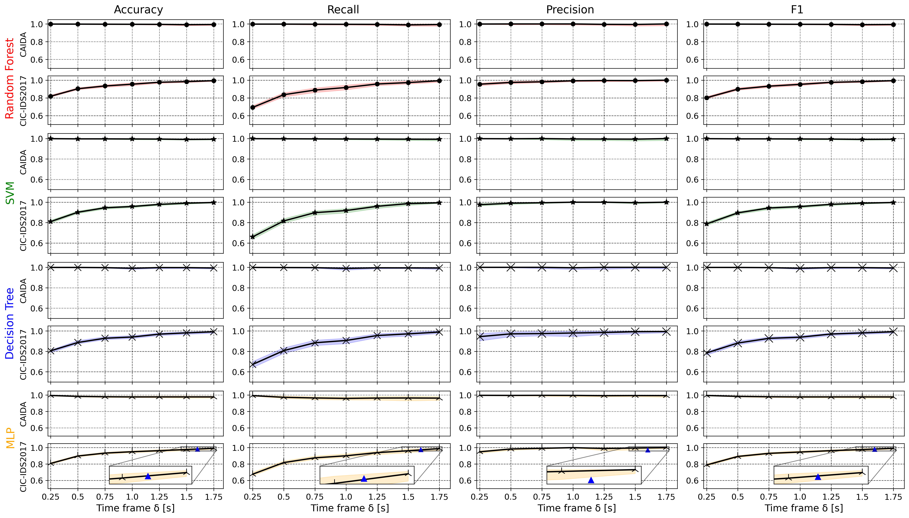
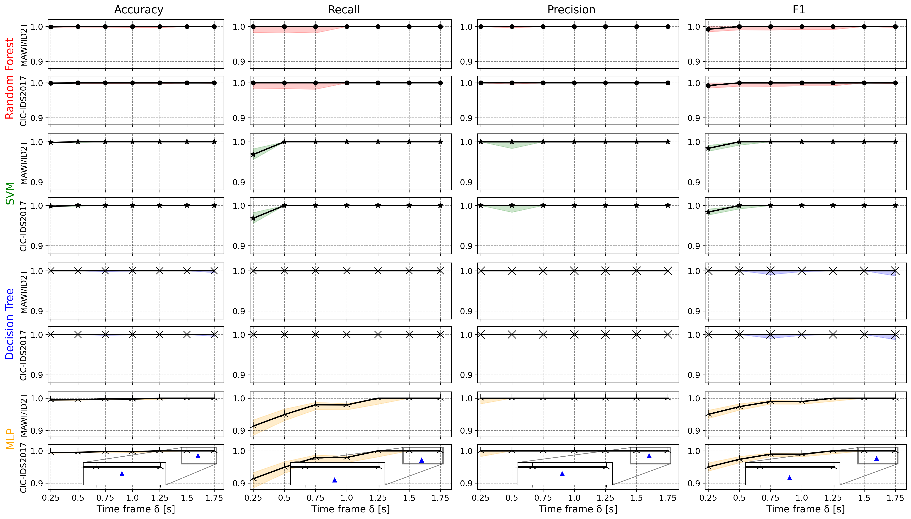
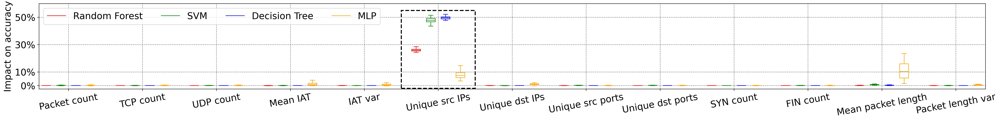
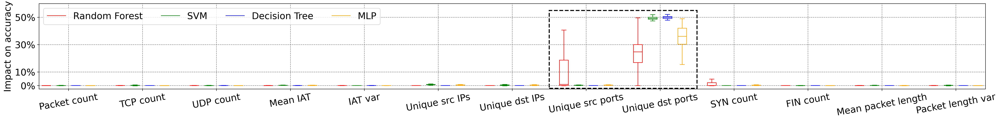
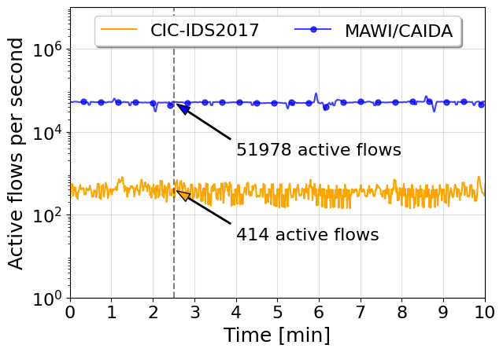
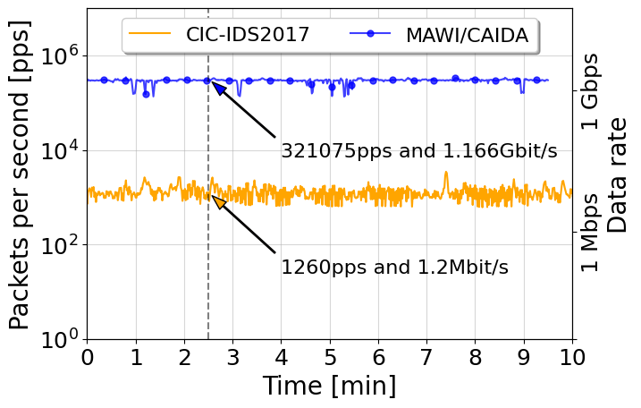
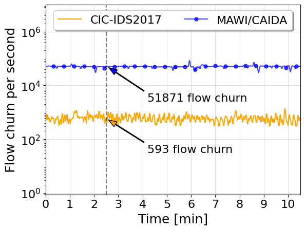

# eMinD: Efficient and Micro-Flow Independent Detection of Distributed Network Attacks
This repository contains code to reproduce the results of eMinD (models, data set preprocessing and evaluation).

## Repository Structure
* <b>data/</b> <br>
Store raw data sets here ([CIC-IDS2017](), [MAWI](https://mawi.wide.ad.jp/mawi/samplepoint-F/2023/), [CAIDA 2007](https://www.caida.org/catalog/datasets/ddos-20070804_dataset/))
* <b>training/</b> <br>
Contains scripts for hyperparameter tuning (grid search with cross validation) and training.
* <b>evaluation/</b> <br>
Contains scripts for matplotlib visualization of results.
* <b>statistics/</b> <br>
Contains scripts for calculation and visualization of flow and packet statistics of the utilized data sets.

## Datasets
* CIC-IDS2017
* Self-composed traffic containing [MAWI](https://mawi.wide.ad.jp/mawi/samplepoint-F/2023/) background traffic and either of the following:
    * [ID2T](https://github.com/tklab-tud/ID2T) injected port scan
    * [CAIDA 2007](https://www.caida.org/catalog/datasets/ddos-20070804_dataset/) DDoS traffic

## Repository Setup
1. Download required data sets (you can use provided scripts for that).
    1. Download MAWI background traffic traces and store the decompressed version in the data/ directory.
    2. Download the CIC-IDS2017 data set and place the Friday trace in the data/ directory.
    3. Download the CAIDA2007 data set and place the decompressed traces (5 min chunks) in the data/ directory.
```
cd data/downloads/
./download_caida.sh
./download_cic.sh
./download_mawi.sh
```
2. Create individual training data sets. You can use the proposed script creating 6 individual data sets: MAWI benign, MAWI+CAIDA DDoS, MAWI+ID2T port scan, CIC-IDS2017 benign, CIC-IDS2017 DDoS, CIC-IDS2017 port scan:
    1. Cut port scan, DDoS attacks and benign traffic out of the CIC-IDS2017 Friday data set. Note the different time zones between CIC data and your loca machine when preparing the data!
    2. Create a merged trace combining MAWI and CAIDA traffic. There is a script provided in the data/ directory that aligns timestamps before merging!
    3. Inject an authentic port scan into MAWI background traffic.
    4. Create chunks of the data sets to enable parallel processing.
    5. Perform time frame aggregation for all data sets and time frames 0.25s, ..., 1.75s
```
cd data/
./create_training_data.sh
```
Create individual data sets:
```
cd data/
python aggregation.py mawi mawi_benign
python aggregation.py mawi-ddos mawi_ddos
python aggregation.py mawi-portscan mawi_portscan

python aggregation.py cic-ddos cic_ddos
python aggregation.py cic-benign cic_benign
python aggregation.py cic-portscan cic_portscan
```
3. Perform hyperparameter optimization for all combinations of individual models, data sets, and time frames. You can use the proposed script for that. Results are stored in a json file that will be read before training:
    - training/hyperparameters/hyperparameter_search.sh<br>
    <i>This step might take a while depending on your machine. Therefore, results are already provided in this repository.</i>
```
cd training/hyperparameters/
./hyperparameter_search.sh
```
Search hyperparameters for individual data sets and models:
```
cd training/hyperparameters/
python hyperparameter_tuning.py -b cic_benign -a cic_ddos
python hyperparameter_tuning.py -b mawi_benign -a mawi_ddos
python hyperparameter_tuning.py -b cic_benign -a cic_portscan
python hyperparameter_tuning.py -b mawi_benign -a mawi_portscan
```

## Training and Testing
After data set creation and hyperparameter search/optimization, run the training. Results are stored in json format and can be used for visualization (/visualization/ml_matrix.ipynb)

```
python training.py -t training_parameters.json -b cic_benign -a cic_ddos
python training.py -t training_parameters.json -b mawi_benign -a mawi_ddos
python training.py -t training_parameters.json -b cic_benign -a cic_portscan
python training.py -t training_parameters.json -b mawi_benign -a mawi_portscan
```
DDoS:

Portscan:

## Feature Importance
After data set creation and hyperparameter search/optimization, you can also run the
feature importance evaluation. Results are also stored in json format and visualization
scripts are included in this repository (/visualization/feature_importance.ipynb).

```
cd training
python feature_importance.py -t 0.5 -b cic_benign -a cic_ddos
python feature_importance.py -t 0.5 -b mawi_benign -a mawi_ddos
```
DDoS:

Portscan:


## Micro-flow and Packet Statistics
Run the scripts in the statistics/ directory to analyze the given data sets.
Visualization scripts are also provided in the same direcory.

```
cd statistics
python flows_per_second_cic_ddos.py
python flows_per_second_mawi_ddos.py
classification_durtaion.py
```
<p align="center">
    
    
    
</p>